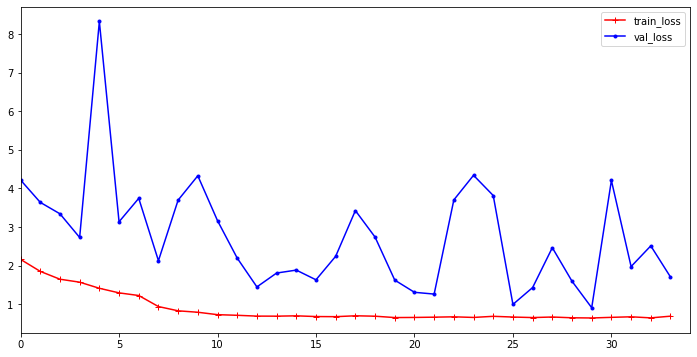
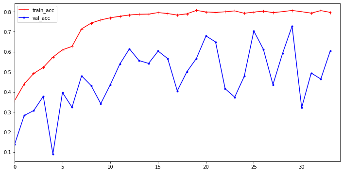
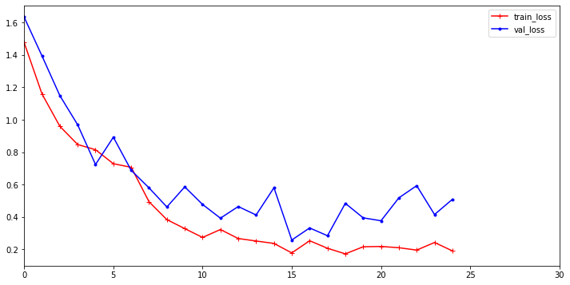
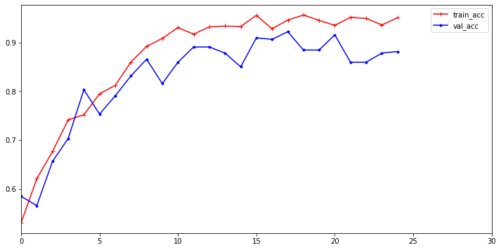

# VideoClassification
Hey, here I have implemented a video classification model which has ResNet+LSTM architecture.

A pretrained version of Resnet on imagenet is used, which is then freezed.
LSTM takes the input from resnet model for different frames. For simplicity I have used 30 frames per video.

2 Datasets are used: UCF50, and UCF11, and corresponding branches are colab_ucf50 and colab_ucf11 respectively.

##To run the code (branch colab_ucf50), please do the following steps.

1, Download the dataset and unzip it
! wget 'https://www.crcv.ucf.edu/data/UCF50.rar' --no-check-certificate
! unrar x UCF50.rar

2, !mkdir ALL_FRAMES

3, !python videoClassification/main.py -1

-1 means no pretrained model available, gt 0 means pretrained model available. Please change OLD_PATH and PATH variables in train function in the main.py.

###Links to pretrained models
UCF-50

UCF-11

###RESULTS
####UCF-50

####UCF-11

